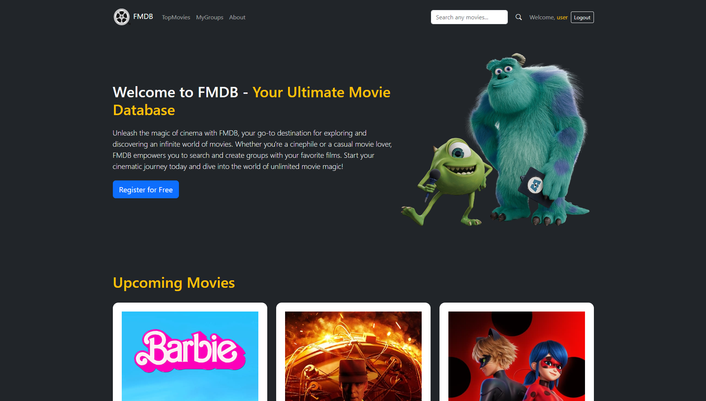

# FMDB - Movie Database Web App

FMDB is a movie database web application that allows users to search for movies, create groups, and manage their favorite movies in those groups. The application uses the TMDb (The Movie Database) API to fetch movie information, and it is built using Node.js, Express.js, Handlebars, and Bootstrap 5.

 <!-- Add a screenshot of your app here -->

## Features

- Search for movies by title or keyword.
- View detailed information about a specific movie.
- Create user accounts and login to access personalized features.
- Create, edit, and delete groups to organize your favorite movies.
- Add and remove movies to/from your groups.

## How to Use

1. Clone the repository: `git clone https://github.com/your-username/FMDB.git`
2. Install dependencies: `npm install`
3. Create a `.env` file and add your TMDb API key:
```bash
API_KEY=your_tmdb_api_key_here
```
4. Start the server: `npm start`
5. Access the application in your web browser at `http://localhost:8888`

## Technologies Used

- Node.js
- Express.js
- Handlebars (hbs)
- Bootstrap 5
- TMDb API

## Contributions

Contributions to FMDB are welcome! If you find any issues or have ideas for improvements, feel free to open an issue or submit a pull request.

## Disclaimer

The project is still under development specially in terms of Front End. 

## License

This project is licensed under the [MIT License](LICENSE).

## Acknowledgments

- Special thanks to the creators of Bootstrap, Handlebars, and Express.js for their awesome frameworks.

## Contact

For any questions or inquiries, please contact [frutuoso671@gmail.com].
