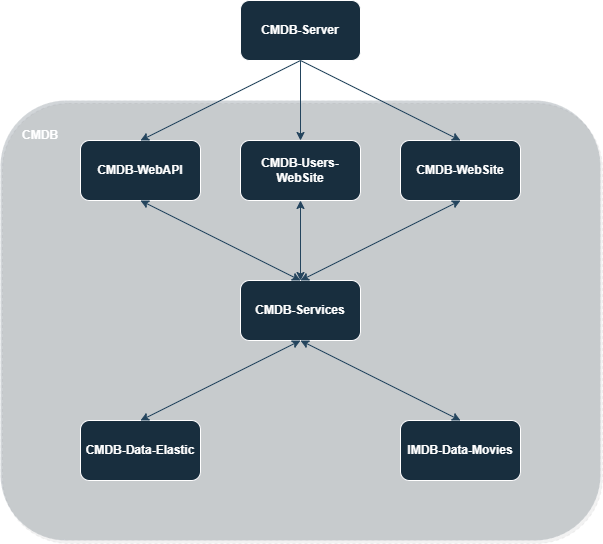
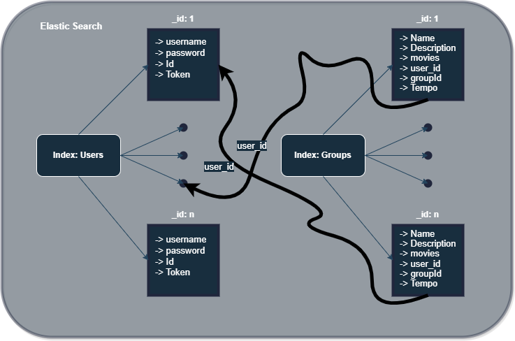

# CMDb Website documentation

### University : Instituto Superior de Engenharia de Lisboa

### Authors : 
    - Daniel Carvalho (49419)
    - Gonçalo Frutuoso (49495)
    - Ricardo Cristino (49417)

### Professors : 
    - Luis Falcão 
    - Filipe Freitas

## Application Structure



1. fmdb-server.mjs - This file contains the main entry point of the server application, where lies the routes.
2. fmdb-web-api.mjs - The module enables communication between the client and server through JSON responses. This means that all services can be used without a graphical interface by an automated client, like the TMDB API is being used in the imdb-movie-data module. Additionally, it enables the graphical interface to make requests to the server without receiving unneeded information, such as when updating a group or adding/removing movies or groups in the database.
3. fmdb-web-site.mjs - This file refers to the user interface. It displays only necessary information in a dynamic and fluid manner, making it easier and quicker for the user to access. The HandleBars formatting language ensures dynamism and CSS ensures smoothness, allowing HTML pages to be designed in a way that presents information to the user in the most straightforward way possible.
4. fmdb-services.mjs - This module is responsible for the internal security of the server and manages communication between various requests (API, web-site) and the database. It must be as reliable as possible to ensure that every request undergoes a thorough check before the data is stored in the internal memory. Failing to do so could lead to corruption of existing information or the introduction of malicious or incorrect information.
5. tmdb-data-movies - This module communicates with the TMDB API, allowing the program to request information such as movie details, searching for specific titles, or displaying the top most well-known films.
6. fmdb-data-elastic - The data elastic module is the foundation for keeping track of each user's information, enabling the addition and/or removal of groups and movies and updating group information. It also keeps user credentials for validation and new user registration in the database.
7. fmdb-users-web-site - This module is responsible for all log in and sign up actions. It handles the authentication and authorization of users, enabling them to access their individual information and perform actions such as adding or removing groups and movies. The module ensures that only authorized users have access to the system and that their information is secure.


## Data Storage Design 



## Elastic Search Mapping

The database uses elastic search and its organized in 2 indices:
  - Users:

In this indice are stored all the data of the user meaning: username, password, userId and token. 
When creating a new user, a user is going to be added to the database and first of all, its done a verification
of the user username to check if the name is already being used.
On the login opeartion its done used the _search method on the database to check if there is a match on
username and password info, only allowing log in if the user is created and has matching credentials.

  - Groups:

The groups indice stores all data that a group is composed: name, description, movies, user_Id, groupId, TotalTime (total time of all movies).
Creating the group is used a PUT method and is created a randomID for the group, the user_Id that is stored on the group info has a high
importance because its the one used in the relation between a user and his groups.
To eliminate a movie from the group, its runned a small script to delete a movie from the movies array, just uptading the group itself. So in
this case its just created a array of movies object instead of creating a index for the movies, wich would also be a valid option.


## Server API documentation

```YAML 
openapi: 3.0.1
info:
  title: FMDB API
  description: This is a simple movies API
  contact:
    email: frutuoso671@gmail.com
  license:
    name: Apache 2.0
    url: http://www.apache.org/licenses/LICENSE-2.0.html
  version: 1.0.1
servers:
  - description: Localhost server for testing API
    url: http://localhost:8888/

tags:
- name: Users
- name: Movies
- name: Groups

paths:
  /users:
    post:
      tags:
      - Users
      summary: Adds a user
      description: Adds a user to the system
      operationId: addUser
      requestBody:
        description: User to add
        content:
          application/json:
            schema:
              $ref: '#/components/schemas/NewUser'
        required: false
      responses:
        201:
          description: user created
          content:
            application/json:
              schema:
                required:
                - token
                type: object
                properties:
                  token:
                    type: string
                    format: uuid
        400:
          description: Invalid input, object invalid
          content: {}
      x-codegen-request-body-name: user
  /users/{userId}/groups: 
    post:
      tags:
      - Groups
      summary: Adds a group to a user
      description: Adds a group to the system
      operationId: addGroup
      requestBody:
        description: Group to add
        content:
          application/json:
            schema:
              $ref: '#/components/schemas/NewGroupCreated'
        required: false
      responses:
        201:
          description: Group created
          content:
            application/json:
              schema:
                required:
                - id
                - description
                type: object
                properties:
                  token:
                    type: string
                    format: uuid
        400:
          description: Invalid input, object invalid
          content: {}
      x-codegen-request-body-name: group
  /users/{userId}/groups/{groupId}:
    get:
      tags:
      - Groups
      summary: Get a group given the id 
      description: By passing in the appropriate options, you can search for one group
      operationId: getGroupId
      security:
        - bearerAuth: []
      parameters:
      - name: Authorization
        in: header
        required: false
        schema:
          type: string
          format: uuid
      - name: id
        in: query
        description: pass an optional search string for looking up movies with that segment
        schema:
          type: integer
          example: 1
      responses:
        200:
          description: search results matching criteria
          content:
            application/json:
              schema:
                type: array
                items:
                  $ref: '#/components/schemas/NewGroup'
        400:
          description: bad input parameter
          content: 
            application/json:
              schema:
                $ref: '#/components/schemas/InvalidRequest'
    delete:
      tags:
      - Groups
      summary: Delete a group by ID
      description: Delete a group by ID
      operationId: deleteGroup
      security:
        - bearerAuth: []
      parameters:
      - name: groupkId
        in: path
        description: ID of the task to be deleted
        required: true
        schema:
          type: integer
      responses:
        400:
          description: Invalid ID supplied
          content: {}
        404:
          description: Task not found
          content: {}
    put:
      tags:
      - Groups
      summary: Updates a group by ID
      description: Updates a group in the system
      operationId: updateGroup
      security:
        - bearerAuth: []
      parameters:
      - name: Authorization
        in: header
        required: true
        schema:
          type: string
          format: uuid
      - name: groupId
        in: path
        description: ID of the task to be updated
        required: true
        schema:
          type: integer
      requestBody:
        description: Information to add
        content:
          application/json:
            schema:
              $ref: '#/components/schemas/NewGroup'
        required: false
      responses:
        201:
          description: Group updated
          content: {}
        404:
          description: Group not found
          content: {}
  /topMovies:
    get:
      tags:
      - Movies
      summary: Gets top best movies
      description: By passing in the appropriate options, you can search for available Movies
      operationId: getMovies
      security:
        - bearerAuth: []
      parameters:
      - name: Authorization
        in: header
        required: false
        schema:
          type: string
          format: uuid
      - name: skip
        in: query
        description: number of movies to skip for pagination
        schema:
          minimum: 0
          type: integer
      - name: limit
        in: query
        description: maximum number of movies to return
        schema:
          maximum: 250
          minimum: 0
          type: integer
      responses:
        200:
          description: search results matching criteria
          content:
            application/json:
              schema:
                type: array
                items:
                  $ref: '#/components/schemas/Movie'
        400:
          description: bad input parameter
          content: 
            application/json:
              schema:
                $ref: '#/components/schemas/InvalidRequest'
  /movies:
    get:
      tags:
      - Movies
      summary: Gets movies by a name or expression
      description: By passing in the appropriate options, you can search for available Movies
      operationId: getMovies
      security:
        - bearerAuth: []
      parameters:
      - name: Authorization
        in: header
        required: false
        schema:
          type: string
          format: uuid
      - name : expression
        in: query
        description: name that its use to search for movies
        schema:
          type: string
          example: sipder
      - name: skip
        in: query
        description: number of movies to skip for pagination
        schema:
          minimum: 0
          type: integer
      - name: limit
        in: query
        description: maximum number of movies to return
        schema:
          maximum: 250
          minimum: 0
          type: integer
      responses:
        200:
          description: search results matching criteria
          content:
            application/json:
              schema:
                type: array
                items:
                  $ref: '#/components/schemas/Movie'
        400:
          description: bad input parameter
          content: 
            application/json:
              schema:
                $ref: '#/components/schemas/InvalidRequest'
  /movies/movie/{id}:
    get:
      tags:
      - Movies
      summary: Gets movies by a given id.
      description: By passing in the appropriate options, you can search for available Movies
      operationId: getMoviesById
      security:
        - bearerAuth: []
      parameters:
      - name: Authorization
        in: header
        required: false
        schema:
          type: string
          format: uuid
      - name : expression
        in: query
        description: name that its use to search for movies
        schema:
          type: integer
          example: tt2154008
      responses:
        200:
          description: search results matching criteria
          content:
            application/json:
              schema:
                type: array
                items:
                  $ref: '#/components/schemas/Movie'
        400:
          description: bad input parameter
          content: 
            application/json:
              schema:
                $ref: '#/components/schemas/InvalidRequest'
  /groups:
    get: 
      tags:
      - Groups
      summary: Get all Groups
      description: By passing in the appropriate options, you can search for available Groups
      operationId: getAllGroups
      security:
        - bearerAuth: []
      parameters:
      - name: Authorization
        in: header
        required: false
        schema:
          type: string
          format: uuid
      - name: skip
        in: query
        description: number of Groups to skip for pagination
        schema:
          minimum: 0
          type: integer
      - name: limit
        in: query
        description: maximum number of movies to return
        schema:
          maximum: 250
          minimum: 0
          type: integer
      responses:
        200:
          description: search results matching criteria
          content:
            application/json:
              schema:
                type: array
                items:
                  $ref: '#/components/schemas/Movie'
        400:
          description: bad input parameter
          content: 
            application/json:
              schema:
                $ref: '#/components/schemas/InvalidRequest'
  /groups/{groupId}/{movieId}:
    delete:
      tags:
      - Groups
      summary: Delete a movie by ID
      description: Delete a movie from a group given movieID
      operationId: deleteMovie
      security:
        - bearerAuth: []
      parameters:
      - name: groupId
        in: path
        description: ID of the group to be updated
        required: true
        schema:
          type: integer
      - name: movieId
        in: query
        description: ID of the movie to be added to the group
        required: true
        schema:
          type: string
      responses:
        400:
          description: Invalid ID supplied
          content: {}
        404:
          description: Group not found
          content: {}
    put:
      tags:
      - Groups
      summary: add a movie to a group given the movieId
      description: Updates a group in the system
      operationId: updateGroup
      security:
        - bearerAuth: []
      parameters:
      - name: Authorization
        in: header
        required: true
        schema:
          type: string
          format: uuid
      - name: groupId
        in: path
        description: ID of the group to be updated
        required: true
        schema:
          type: integer
      - name: movieId
        in: query
        description: ID of the movie to be added to the group
        required: true
        schema:
          type: string  
      requestBody:
        description: Movie to add
        content:
          application/json:
            schema:
              $ref: '#/components/schemas/NewGroup'
        required: false
      responses:
        201:
          description: Group updated
          content: {}
        404:
          description: Group not found
          content: {}
  /groups/newGroup:
    get: 
        tags:
        - Groups
        summary: Get new Group
        description: By passing in the appropriate options, you can search for available Groups
        operationId: getNewGroup
        security:
          - bearerAuth: []
        parameters:
        - name: Authorization
          in: header
          required: false
          schema:
            type: string
            format: uuid
        - name: skip
          in: query
          description: number of Groups to skip for pagination
          schema:
            minimum: 0
            type: integer
        - name: limit
          in: query
          description: maximum number of movies to return
          schema:
            maximum: 250
            minimum: 0
            type: integer
        responses:
          200:
            description: search results matching criteria
            content:
              application/json:
                schema:
                  type: array
                  items:
                    $ref: '#/components/schemas/Movie'
          400:
            description: bad input parameter
            content: 
              application/json:
                schema:
                  $ref: '#/components/schemas/InvalidRequest'
components:
  securitySchemes:
    bearerAuth:            # arbitrary name for the security scheme
      type: http
      scheme: bearer
  schemas:
    Movie:
      required:
      - id
      - title
      - userId

      type: object
      properties:
        id:
          type: integer
        title:
          type: string
          example: Study HTTP
        userId:
          type: integer
    NewGroup:
      required:
      - id
      - title
      - description
      - userId

      type: object
      properties:
        id:
          type: integer
          example: 1
        title:
          type: string
          example: Group Title
        description:
          type: string
          example: Group description
        userId:
          type: integer
    NewUser:
      required:
      - userName
      type: object
      properties:
        userName:
          type: string
          example: joao
    InvalidRequest:
      type: object
      properties:
        error:
          type: string
          example: "Missing required parameter"
    NewGroupCreated:
      required:
      - status
      - group
      type: object
      properties:
        status:
          type: string
          example: Group with id 11 created with success
        group:
          $ref: '#/components/schemas/NewGroup'
```


## How to Run the Application

In order to the user run the application, the user runs the command pronpt and if it does not have already all plug-in's installed,
needs to run the following commands: 
"npm install express express-handlebars express-session hbs node-fetch passport morgan cookie-parser cors yamljs nodemon".

When all the plug-in's are correctly installed, in order to run the web application just needs to run the program, on the server file
using the following command : "nodemon .\code\fmdb-server.mjs" and it should pop up a link on the command prompt with the following link: http://localhost:8888/home, now the web site is running.

For the sake of using all the features of the website, the user should decide if wants to use a local memory or elastic search database, 
only chosing one in the cmdb-server module, to make this choice the user needs to change the import, only having one of these two:
```bash
import * as fmdbData from './data/local/fmdb-data-mem.mjs'
import * as fmdbUsersData from './data/local/fmdb-users-data-mem.mjs'
 ```
```bash
import * as fmdbData from './data/db/fmdb-data-elastic.mjs'
import * as fmdbUsersData from './data/db/fmdb-users-data-elastic.mjs'
 ```

If its going to run using elastic search, the database of the elastic search should be running
before running the application. You can get the elastic search db in the oficial website and running the bat file.

After all this steps the web site should be running perfectly, enjoy!
